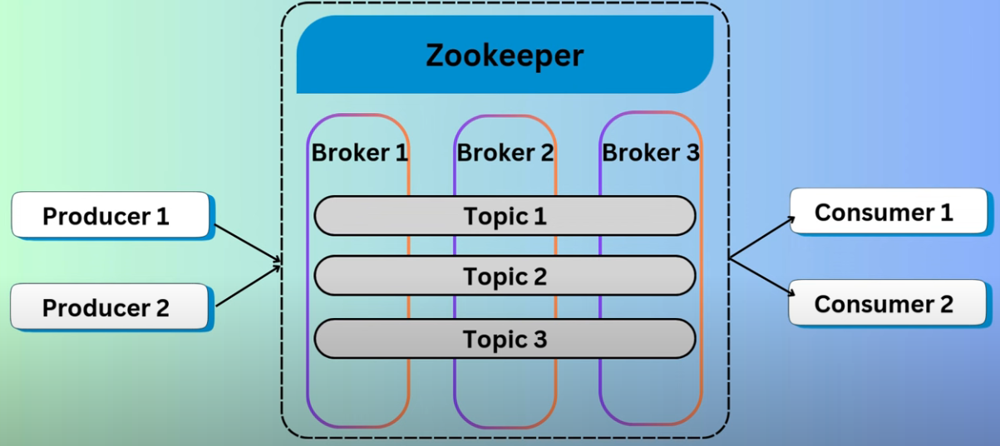
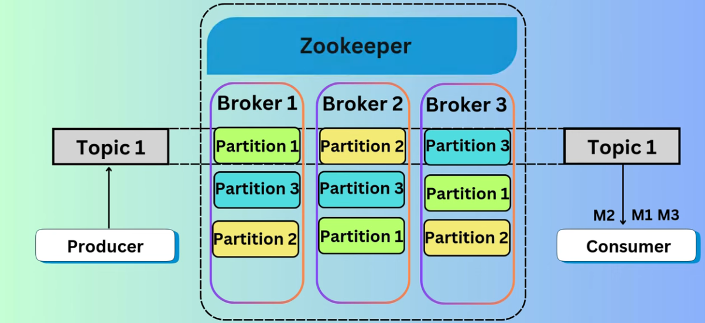

<style>
r { color: Red }
o { color: Orange }
g { color: Green }
m1 {background-color: #137a55; color: #DDDDDD; font-weight: bold;}
m2 {background-color:rgb(190, 250, 151); color:rgb(8, 3, 24); font-weight: bold;}
m3 {background-color:rgb(250, 215, 151); color:rgb(58, 3, 33); font-weight: bold;}
</style>

## <m2>Kafka Hands-on - docker</m2>

### Important Concepts:


<table class="table table-bordered">
<tbody><tr>
<th style="text-align:center;">S.No</th>
<th style="text-align:center;">Components and Description</th>
</tr>
<tr>
<td>1</td>
<td><p><b>Topics</b></p>
<p>A stream of messages belonging to a particular category is called a topic. Data is stored in topics.</p>
<p>Topics are split into partitions. For each topic, Kafka keeps a mini-mum of one partition. Each such partition contains messages in an immutable ordered sequence. A partition is implemented as a set of segment files of equal sizes.</p>
</td>
</tr>
<tr>
<td>2</td>
<td><p><b>Partition</b></p>
<p>Topics may have many partitions, so it can handle an arbitrary amount of data.</p>
</td>
</tr>
<tr>
<td>3</td>
<td>
<p><b>Partition offset</b></p>
<p>Each partitioned message has a unique sequence id called as <q>offset</q>.</p>
</td>
</tr>
<tr>
<td>4</td>
<td>
<p><b>Replicas of partition</b></p>
<p>Replicas are nothing but <q>backups</q> of a partition. Replicas are never read or write data. They are used to prevent data loss.</p>
</td>
</tr>
<tr>
<td>5</td>
<td>
<p><b>Brokers</b></p>
<ul class="list">
<li><p>Brokers are simple system responsible for maintaining the pub-lished data. Each broker may have zero or more partitions per topic. Assume, if there are N partitions in a topic and N number of brokers, each broker will have one partition.</p></li>
<li><p>Assume if there are N partitions in a topic and more than N brokers (n + m), the first N broker will have one partition and the next M broker will not have any partition for that particular topic.</p></li>
<li><p>Assume if there are N partitions in a topic and less than N brokers (n-m), each broker will have one or more partition sharing among them. <m1>This scenario is not recommended</m1> due to unequal load distri-bution among the broker.</p></li>
</ul>
</td>
</tr>
<tr>
<td>6</td>
<td>
<p><b>Kafka Cluster</b></p>
<p>Kafka’s having more than one broker are called as Kafka cluster. A Kafka cluster can be expanded without downtime. These clusters are used to manage the persistence and replication of message data.</p>
</td>
</tr>
<tr>
<td>7</td>
<td>
<p><b>Producers</b></p>
<p>Producers are the publisher of messages to one or more Kafka topics. Producers send data to Kafka brokers. Every time a producer pub-lishes a message to a broker, the broker simply appends the message to the last segment file. Actually, the message will be appended to a partition. Producer can also send messages to a partition of their choice.</p>
</td>
</tr>
<tr>
<td>8</td>
<td>
<p><b>Consumers</b></p>
<p>Consumers read data from brokers. Consumers subscribes to one or more topics and consume published messages by pulling data from the brokers.</p>
</td>
</tr>
<tr>
<td>9</td>
<td>
<p><b>Leader</b></p>
<p><q>Leader</q> is the node responsible for all reads and writes for the given partition. Every partition has one server acting as a leader.</p>
</td>
</tr>
<tr>
<td>10</td>
<td>
<p><b>Follower</b></p>
<p>Node which follows leader instructions are called as follower. If the leader fails, one of the follower will automatically become the new leader. A follower acts as normal consumer, pulls messages and up-dates its own data store.</p>
</td>
</tr>
</tbody></table>


### Kafka - Diagram - 1


### Kafka - Diagram - 2



### Step 1 - Setting up Kafka in Docker
Docker-Compose:
```yaml
version: '3'
services:
  zookeeper:
    image: zookeeper:3.6.3
    ports:
      - "2181:2181"
  kafka:
    image: wurstmeister/kafka:2.13-2.7.0
    ports:
      - "9092:9092"
    environment:
      KAFKA_LISTENERS: PLAINTEXT://0.0.0.0:9092
      KAFKA_ADVERTISED_LISTENERS: PLAINTEXT://localhost:9092
      KAFKA_ZOOKEEPER_CONNECT: zookeeper:2181
    depends_on:
      - zookeeper
    volumes:
      - /var/run/docker.sock:/var/run/docker.sock
```

Commands:
```bash
#Access Kafka container:
docker exec -it <kafka_container_id> /bin/bash

# Locate Kafka binaries:
cd /opt/kafka/bin

# create topic 
./kafka-topics.sh --create --topic test-topic --bootstrap-server localhost:9092 --replication-factor 1 --partitions 1

# Run Kafka Producer
./kafka-console-producer.sh --topic test-topic --bootstrap-server localhost:9092

# Run Kafka Consumer:
docker exec -it <kafka_container_id> /bin/bash
cd /opt/kafka/bin
./kafka-console-consumer.sh --topic test-topic --bootstrap-server localhost:9092 --from-beginning


## Creating a Topic with Multiple Partitions: 
docker exec -it <kafka_container_id> /bin/bash
cd /opt/kafka/bin
./kafka-topics.sh --create --topic test-topic-two --bootstrap-server localhost:9092 --replication-factor 1 --partitions 3 # it will throw error if topic is already there
```

## Step 2:  Implementing Producer/Consumer with Spring Boot
#### Prerequisite
```
   Lang         - java
   Proj         - Gradle Kotlin
   Group        - com.example
   Artif        - producer
   Spring Boot  - 3.2.3
   Packaging    - Jar
   Java         - 17
   Dependencies - 
       1. Spring Web 
       2. Spring For Apache Kafka 
```
### Sample Java Code:
1. https://www.youtube.com/watch?v=bU6f-E9VFvw <br>
   https://codeopstrek.com/what-is-apache-kafka-spring-boot-setup/
2. https://www.youtube.com/watch?v=ei6fK9StzMM <br>
   https://github.com/LearnCodeWithDurgesh/Apache-Kafka--Yt-Cc
3. https://learn.conduktor.io/kafka/complete-kafka-producer-with-java/

### <m1>Producer</m1>
```java
src/main/java/com/deliveryboy
│
├── controller
│      └── ProducerController.java // Endpoint to trigger message production
│
├── service
│     └── ProducerService.java // Service to send messages to Kafka topics
│
└── config
         └── AppConstants.java // Constants to be used in whole Producer Codes
         └── KafkaConfig.java // Kafka topic creation configuration

src/main
└── resources
      └── application.properties
```
#### <m2>Controller</m2>
```java
//com/deliveryboy/controller/LocationController.java
package com.deliveryboy.controller;

import com.deliveryboy.service.KafkaService;
import org.springframework.beans.factory.annotation.Autowired;
import org.springframework.http.HttpStatus;
import org.springframework.http.ResponseEntity;
import org.springframework.web.bind.annotation.PostMapping;
import org.springframework.web.bind.annotation.RequestMapping;
import org.springframework.web.bind.annotation.RestController;

import java.util.Map;

@RestController
@RequestMapping("/location")
public class LocationController {

    @Autowired
    private KafkaService kafkaService;

    @PostMapping("/update")
    public ResponseEntity<?> updateLocation() {

        for (int i = 1; i <= 200000; i++) {
            this.kafkaService.updateLocation("( " + Math.round(Math.random() * 100) + " , " + Math.round(Math.random() * 100) + " " + ")");
        }

        return new ResponseEntity<>(Map.of("message", "Location updated"), HttpStatus.OK);
    }
}
```
#### <m2>Service</m2>
```java
//com/deliveryboy/service/KafkaService.java
package com.deliveryboy.service;

import com.deliveryboy.config.AppConstants;
import org.slf4j.Logger;
import org.slf4j.LoggerFactory;
import org.springframework.beans.factory.annotation.Autowired;
import org.springframework.kafka.core.KafkaTemplate;
import org.springframework.stereotype.Service;

@Service
public class KafkaService {

    @Autowired
    private KafkaTemplate<String, String> kafkaTemplate;

    private Logger logger = LoggerFactory.getLogger(KafkaService.class);

    public boolean updateLocation(String location) {

        this.kafkaTemplate.send(AppConstants.LOCATION_TOPIC_NAME, location);

        return true;
    }

}
```
#### <m2>Config</m2>
```java
//com/deliveryboy/config/AppConstants.java
package com.deliveryboy.config;

public class AppConstants {
  public static final String LOCATION_TOPIC_NAME="location-update-topic";
}
```
```java

//com/deliveryboy/config/KafkConfig.java
package com.deliveryboy.config;

import org.apache.kafka.clients.admin.NewTopic;
import org.springframework.context.annotation.Bean;
import org.springframework.context.annotation.Configuration;
import org.springframework.kafka.config.TopicBuilder;

@Configuration
public class KafkaConfig {
    @Bean
    public NewTopic topic() {
        return TopicBuilder
                .name(AppConstants.LOCATION_TOPIC_NAME)
                .partitions(1)
                .replicas(1)
                .build();
    }
}
```
#### <m2>Application properties:</m2>
```bash
#Producer configuration
spring.kafka.producer.bootstrap-servers=localhost:9092
spring.kafka.producer.key-serializer=org.apache.kafka.common.serialization.StringSerializer
spring.kafka.producer.value-serializer=org.apache.kafka.common.serialization.StringSerializer
```
### <m1>Consumer</m1>
```java
src/main/java/com/enduser
│
├── AppConstants.java
├── EnduserApplication.java
└── KafkaConfig.java

src/main
└── resources
      └── application.properties
```

```java
// src/main/java/com/enduser/AppConstants.java
package com.enduser;

public class AppConstants {

    public static final String LOCATION_UPDATE_TOPIC="location-update-topic";
    public static final String  GROUP_ID="group-1";

}
```

```java
// src/main/java/com/enduser/EnduserApplication.java
package com.enduser;

import org.springframework.boot.SpringApplication;
import org.springframework.boot.autoconfigure.SpringBootApplication;

@SpringBootApplication
public class EnduserApplication {

	public static void main(String[] args) {
		SpringApplication.run(EnduserApplication.class, args);
	}

}
```

```java
// src/main/java/com/enduser/KafkaConfig.java
package com.enduser;

import org.springframework.context.annotation.Configuration;
import org.springframework.kafka.annotation.KafkaListener;

@Configuration
public class KafkaConfig {


    @KafkaListener(topics = AppConstants.LOCATION_UPDATE_TOPIC, groupId = AppConstants.GROUP_ID)
    public void updatedLocation(String value) {


        System.out.println(value);

    }

}
```

```java
// src/main/java/resources/application.properties
server.port=8081
spring.kafka.consumer.bootstrap-servers=localhost:9092
spring.kafka.consumer.group-id=group-1
spring.kafka.consumer.auto-offset-reset=earliest
spring.kafka.consumer.key-deserializer=org.apache.kafka.common.serialization.StringDeserializer
spring.kafka.consumer.value-deserializer=org.apache.kafka.common.serialization.StringDeserializer
```

## Step 3:  Implementing Producer/Consumer with Python
#### prerequisite -  `pip install kafka-python`
```python
#Producer.py
from kafka import KafkaProducer, KafkaConsumer
from kafka.errors import KafkaError
import json

# Define Kafka producer
producer = KafkaProducer(
    bootstrap_servers=['localhost:9092'],
    value_serializer=lambda v: json.dumps(v).encode('utf-8')
)

# Produce a message
future = producer.send('test-topic', {'key': 'akash'})
try:
    record_metadata = future.get(timeout=10)
except KafkaError as e:
    print(f"Error sending message: {e}")
finally:
    producer.close()
```


```python
#Consumer.py
from kafka import KafkaConsumer
import json
from kafka import KafkaConsumer
import json

# Define Kafka consumer
consumer = KafkaConsumer(
    'test-topic',  # The topic to consume messages from
    bootstrap_servers=['localhost:9092'],  # List of Kafka brokers to connect to
    auto_offset_reset='earliest',  # Where to start reading messages when no offset is stored ('earliest' to read from the beginning)
    enable_auto_commit=True,  # Automatically commit offsets after consuming messages
    value_deserializer=lambda x: x.decode('utf-8') if x else None  # Deserialize message values from bytes to UTF-8 strings
)

# Consume messages with error handling for non-JSON messages
for message in consumer:
    print(message.value)

```

## Kafka Handson - Direct Installation
Notes:
```bash

tar -xvf kafka_2.12-3.3.1.tgz

java -version
sudo yum install java-1.8.0-openjdk
java -version
cd kafka_2.12-3.3.1

#Start Zoo-keeper:
bin/zookeeper-server-start.sh config/zookeeper. properties

#Start Kafka-server:
#Duplicate the session & enter in a new console —
export KAFKA_HEAP_OPTS="-Xnx256M -Xms128M"
cd kafka_2.12-3.3.1
bin/kafka-server-start.sh config/server.properties

#It is pointing to private server , change server.properties so that it can run in public IP

#It is pointing to private server , change server.properties so that it can run in public IP

#To do this , you can follow any of the 2 approaches shared belwo —
#Do a “sudo nano config/server.properties" - change ADVERTISED_LISTENERS to public ip of the EC2 instance

#Create the topic:

#Duplicate the session & enter in a new console —-
cd kafka_2.12-3.3.1
bin/kafka-topics.sh —create —topic demo_test —bootstrap-server 65.2.168.105:9092 —replication-factor 1 —partiti

#Start Producer:

bin/kafka-console-producer.sh topic demo_test| —bootstrap-server 65.2.168.105:9092
#
#Start Consumer:

#Duplicate the session & enter in a new console —
cd kafka_2.12-3.3.1
bin/kafka-console-consuner.sh topic demo_test —bootstrap-server 65.2.168.105:9092
```


## Python - Producer/Consumer
### prerequisite -  `pip install kafka-python`
```py
#Producer.py
pip install kafka-python
import pandas as pd
from kafka import KafkaProducer
from time import sleep
from json import dumps
import json
producer = KafkaProducer(bootstrap_servers=[':9092'], #change ip here
                         value_serializer=lambda x: 
                         dumps(x).encode('utf-8'))
producer.send('demo_test', value={'surnasdasdame':'parasdasdmar'})
df = pd.read_csv("data/indexProcessed.csv")
df.head()
while True:
    dict_stock = df.sample(1).to_dict(orient="records")[0]
    producer.send('demo_test', value=dict_stock)
    sleep(1)
producer.flush() #clear data from kafka server
```
```py
#Consumer.py
from kafka import KafkaConsumer
from time import sleep
from json import dumps,loads
import json
from s3fs import S3FileSystem
consumer = KafkaConsumer(
    'demo_test',
     bootstrap_servers=[':9092'], #add your IP here
    value_deserializer=lambda x: loads(x.decode('utf-8')))
# for c in consumer:
#     print(c.value)
s3 = S3FileSystem()
for count, i in enumerate(consumer):
    with s3.open("s3://kafka-stock-market-tutorial-youtube-darshil/stock_market_{}.json".format(count), 'w') as file:
        json.dump(i.value, file)   
```

